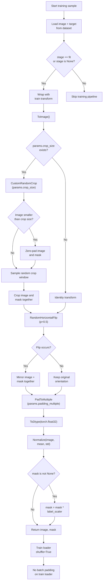
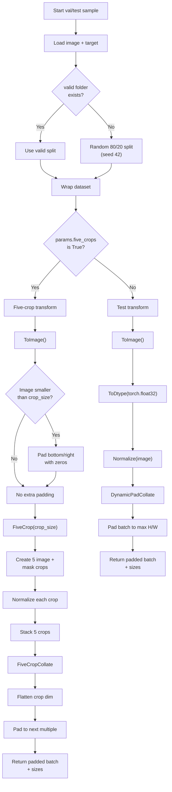

# Data Pipeline & Augmentation Strategy

The actual preprocessing pipeline is implemented across `src/data/dataset.py`, `src/data/transform.py`, and `src/data/datamodule.py`. The important design choice is that the code separates spatial transforms (applied jointly to image and density map) from image-only photometric transforms, so the target map stays spatially aligned with the RGB image while the image gains augmentation and normalization.

## 1. Dataset loading and split logic

The base dataset is `CustomDataset`, which:

- scans `images/*.jpg` and `ground-truth-npy/*.npy`,
- sorts both file lists, and
- asserts that their lengths match exactly.

This is a critical assumption for the project: the code does not match files by name, it relies on parallel ordering. If the counts differ, training fails immediately with an assertion error.

During datamodule setup:

- if the stage is `fit` or `None`, the training split is created,
- if a folder named `valid` exists at `data_root/valid`, that split is used directly,
- otherwise the dataset is split with a deterministic `random_split` using a fixed seed (`42`) into `80% train` and `20% val`.

This logic is implemented in `CrowdDataModule.setup()` and is one of the key branch conditions in the pipeline.

## 2. Training preprocessing steps

Each training sample is transformed by `DatasetTransformWrapper(..., self.apply_train_transforms)`.

The actual training pipeline is:

1. `ToImage()`
   - Converts the PIL image to a tensor.

2. `CustomRandomCrop(params.crop_size)` if `params.crop_size` is set
   - If the image is smaller than the patch size, it is padded first.
   - A random crop window is then sampled and applied to both the RGB image and the density map together.
   - This preserves alignment between image pixels and crowd-density regions.

3. `RandomHorizontalFlip(p=0.5)`
   - The flip is applied to the image and density map simultaneously.
   - The branch condition is the random probability check from PyTorch `RandomHorizontalFlip`.

4. `PadToMultiple(params.padding_multiple)`
   - Pads the right and bottom edges to the next multiple of the configured stride.
   - This keeps spatial sizes compatible with model downsampling and skip connections.

5. `ToDtype(torch.float32, scale=True)`
   - Only the image tensor is converted to float32.
   - The density map remains a float map; its values are scaled later by `label_scaler`.

6. `Normalize(mean=mean, std=std)`
   - Uses the backbone configuration resolved by `timm.data.resolve_data_config()`.
   - This is applied only to the image tensor, not the density map.

7. `mask = mask * (self.params.label_scaler or 1)`
   - Density maps are scaled by `label_scaler` before optimization.
   - This is a training-only conditioning step and is not applied in validation/test transforms.

> The code also contains `SafePhotometricRandAugment`, but in the current implementation it is commented out in `train_image_augs`. So the active preprocessing behavior is the explicit `ToDtype` + `Normalize` pipeline shown above.

## 3. Validation and test preprocessing steps

Validation and test samples are passed through `self.apply_test_transforms` by default. The pipeline is much simpler:

1. `ToImage()`
2. `ToDtype(torch.float32, scale=True)`
3. `Normalize(mean=mean, std=std)`

The mask is intentionally not rescaled during validation/test, and there is no random crop or random flip in the default path.

## 4. Five-crop evaluation mode

If `self.params.five_crops` is `True`, the validation dataset uses a different wrapper:

- `apply_five_crop_transforms()` is applied to each sample,
- the sample is first passed through the deterministic joint transforms,
- if the image is smaller than `crop_size`, it is padded on the bottom/right with zeros,
- then `torchvision.transforms.v2.FiveCrop(crop_size)` is used to generate 5 spatial crops of both the image and the mask,
- each crop is normalized independently using the same image-only normalization pipeline,
- the resulting 5 crop tensors are stacked into one batch.

This is the evaluation branch used for stronger validation coverage when the model is evaluated with a multi-crop strategy.

## 5. Custom collate functions

The collate functions are the main batch-level preprocessing step used after the per-sample transforms.

### `DynamicPadCollate`

This is the default collate for validation/test/training evaluation loaders.

- It computes the original spatial size `(H, W)` for every sample in the batch.
- It finds the maximum height and width in the batch.
- It rounds those values up to the next multiple of `padding_multiple`.
- It pads each image and density mask on the bottom and right edges with zeros to the same target shape.
- It returns:
  - `batched_images`
  - `batched_masks`
  - `original_sizes`

This ensures that all samples in the batch share the same spatial size and remain compatible with the model’s output decoder alignment.

### `FiveCropCollate`

This is used only when `params.five_crops` is enabled.

- It stacks the batch of five-crop outputs,
- flattens the crop dimension into the batch dimension,
- computes the padded shape from the crop size,
- pads all crop tensors to the nearest multiple of `padding_multiple`,
- returns the batch as a single flattened tensor stack with `original_sizes` repeated for each crop.

This allows five-crop validation to behave as one larger batched evaluation set while keeping the original per-sample crop geometry available for metric computation.

---

## 6. Training preprocessing flow

## 7. Validation / test preprocessing flow

---

The overall project logic is therefore:

- training samples are jointly transformed spatially and image-only normalized,
- validation/test samples are kept deterministic,
- the `valid` folder is preferred when present,
- evaluation can switch to five-crop mode by flag,
- and the batch-level padding behavior is handled by `DynamicPadCollate` or `FiveCropCollate` depending on the active evaluation mode.

This is the concrete preprocessing contract implemented by the project code and is the one that should be referenced when documenting dataset behavior in the repository.
