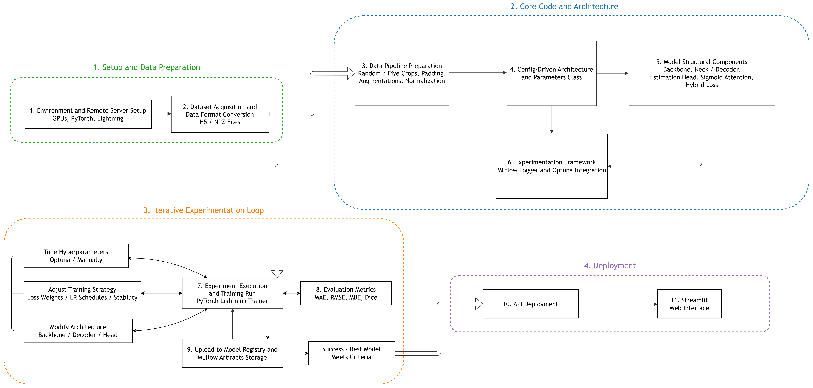
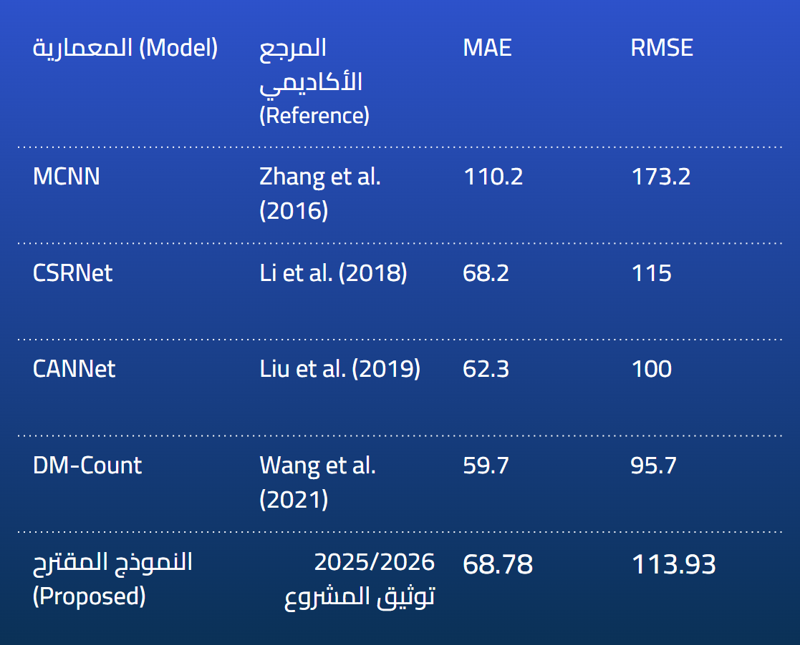
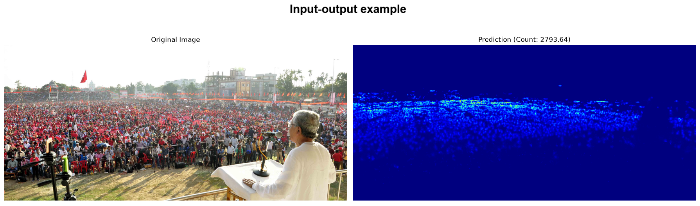
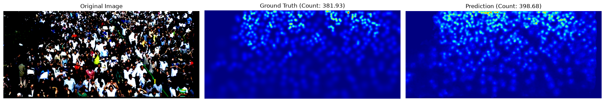
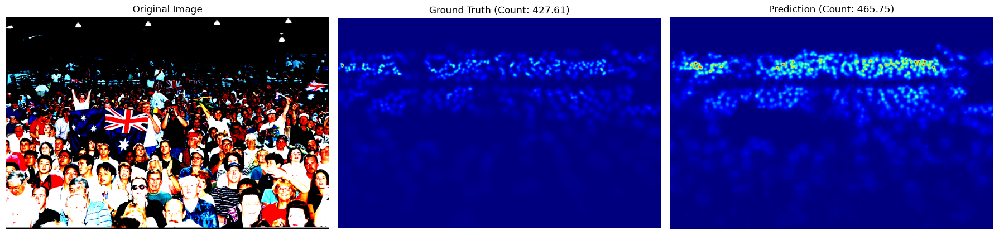
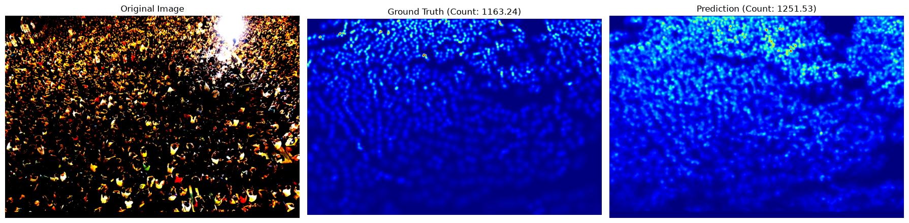

# Crowd Counting Through Density Estimation

An end-to-end computer vision research project for estimating **where people are** and **how many people are present** in challenging crowd scenes.

## Why this project matters

Counting people in dense scenes is difficult. Individuals overlap, perspective changes their apparent size, and backgrounds can contain textures that resemble crowds. A simple object detector or a single image-level count often loses the spatial information needed to handle those conditions.

This project approaches the problem as **density-map regression**. Instead of predicting only one number, the model produces a spatial density field. Integrating that field provides the total count while preserving information about the distribution and concentration of people across the image.

The result is a complete research workflow that connects:

- benchmark datasets and geometry-aware density targets,
- synchronized image and label preprocessing,
- configurable encoder-decoder model architectures,
- attention-based suppression of background false positives,
- composite objectives for structure, density, mask confidence, and count accuracy,
- reproducible training and experiment tracking with PyTorch Lightning, Optuna, and MLflow.

## What makes the work distinctive

The project was developed through deliberate experimentation rather than by assuming that a more complex model would automatically be better. The documented research process includes 32 architecture, data, loss, evaluation, and systems decisions.

Several improvements came from addressing the learning problem directly:

- geometry-adaptive targets preserve scale information caused by perspective,
- focal loss helps the attention head focus on difficult false positives,
- Huber loss improves robustness to large density-map errors,
- carefully selected negative samples teach the model what non-crowd scenes look like,
- soft attention gating avoids brittle manual thresholds,
- count-aware loss and calibrated loss scaling improve aggregate-count behavior,
- fixed crops and dynamic batching make evaluation more practical for large images.

This combination reflects the central lesson of the project: **data quality, learning objectives, and evaluation design can matter as much as architecture selection.**

## Live production model

The trained crowd-counting model is available through a live production application:

**[Open the live Crowd Counter](https://crowd-counter-by-karam-antar.duckdns.org/)**

The application currently serves **model version 75** from the MLflow Model Registry. This deployment demonstrates that the model can be used in a complete path from an uploaded image to a predicted crowd count using the registered model that is being automatically loaded in production environment from MLflow registry.

## Model architecture at a glance

The production model uses a **MAnet encoder-decoder architecture with a ConvNeXt-Base encoder**. Its decoder reconstructs a full-resolution density map, while the attention branch helps distinguish people from visually confusing backgrounds. Soft attention gating and a final convolution make the prediction less sensitive to individual attention errors.

**[Open or download the full v75 architecture diagram (PDF)](06-assets/diagrams/crowd_counter_v75_MAnet_convnext_base.pdf)**

The diagram describes the model with an input of `3 x 256 x 256`, a frozen ConvNeXt-Base encoder, trainable MAnet decoder components, an attention head, density features, soft gating, and a final density convolution. The model contains approximately **121.5 million parameters**, of which approximately **34.0 million are trainable** in the inspected v75 configuration.

## Results snapshot

The project includes a comparison snapshot showing the proposed model alongside established crowd-counting references. The displayed proposed result is **MAE 68.78** and **RMSE 113.93**.

The comparison image is presented as a project result snapshot. Reproducibility depends on the dataset split, preprocessing, model configuration, loss weights, and evaluation procedure used for the run.

## Input and output example

The example below shows the model receiving a dense crowd image and producing a spatial prediction with an estimated count of **2793.64**. The output is a density visualization: brighter regions indicate higher predicted crowd density.

## Qualitative examples

The following examples compare the original crowd image, its ground-truth density map, and the prediction produced by model version 75. They show the model across different crowd densities and visual conditions:

| Example | Ground-truth count | Predicted count |
| --- | ---: | ---: |
| ShanghaiTech Part A sample 4 | 381.93 | 398.68 |
| ShanghaiTech Part A sample 7 | 427.61 | 465.75 |
| ShanghaiTech Part A sample 8 | 1163.24 | 1251.53 |

## Research foundation

The project builds on established density-map crowd-counting research, including:

> Zhang, Y., Zhou, D., Chen, S., Gao, S., and Ma, Y. “Single-Image Crowd Counting via Multi-Column Convolutional Neural Network.” CVPR, 2016.

The paper’s density-map formulation and geometry-adaptive target construction are directly relevant to this project. The current implementation later moved from MCNN to a configurable pretrained encoder-decoder architecture.

Read the complete [paper reference](06-assets/research-papers/zhang-single-image-crowd-counting-mcnn.md).

## Datasets

The documented workflow uses:

- **ShanghaiTech Part A**, a dense crowd benchmark used as the main iteration and tuning dataset.
- **JHU-CROWD++**, a larger and more diverse high-resolution dataset used for broader evaluation and future fine-tuning.
- Additional high-resolution negative samples for improving foreground/background discrimination.

See the [dataset documentation](05-data/01-datasets.md) for acquisition notes, directory structure, density-map labels, scaling, and split behavior.

## Project workflow

1. Prepare the dataset and verify image-density-map alignment.
2. Apply joint spatial preprocessing and image-only normalization.
3. Train an encoder-decoder density-estimation model.
4. Evaluate density structure, total count, mask quality, and directional bias.
5. Track configurations and metrics with MLflow.
6. Compare decisions and refine the model, loss, data, or evaluation strategy based on evidence.

The implementation is organized so that configuration, data, models, experiment orchestration, tracking, and inference remain separate and understandable.

## Explore the project

- [Quickstart](01-onboarding/04-quickstart.md): set up the environment and run training or tuning.
- [Project overview](01-onboarding/03-project-overview.md): understand the purpose and main workflow.
- [System overview](03-architecture/05-system-overview.md): see how the major parts fit together.
- [Component responsibilities](03-architecture/07-component-responsibilities.md): map the documentation to the source tree.
- [Dataset contract](05-data/03-data-contract-checklist.md): verify data before a run.
- [Architecture decisions](04-decisions/01-decision-log.md): follow the evolution of the system and the reasoning behind accepted and rejected approaches.

## Documentation structure

- [Onboarding](01-onboarding): repository orientation and contribution guidance
- [Context](02-context): problem framing, goals, constraints, and domain background
- [Architecture](03-architecture): configuration, data flow, model, inference, training, and component responsibilities
- [Data](05-data): supported datasets, preprocessing, and data-contract checks
- [Decisions](04-decisions): ADRs, migrations, discarded ideas, and lessons from removed approaches

## Scope and honesty note

This repository documents a research and engineering project, not a claim of universal state-of-the-art performance. The result snapshot is meaningful only with its experimental context. Source code, dataset contracts, and serialized model parameters are the authority for reproducing a run; the decision records explain why the current direction was chosen.
